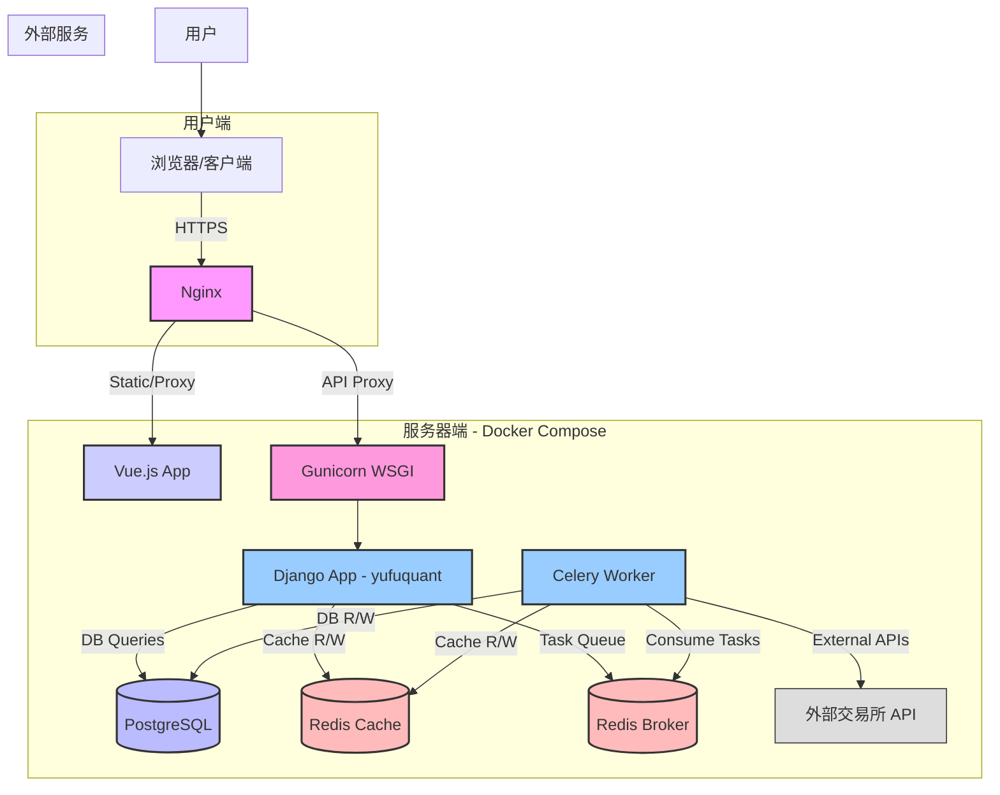

# Architecture for YuFuQuant 量化交易平台

Status: Draft

## Technical Summary

本文档描述了 YuFuQuant 量化交易平台的系统架构。该平台采用前后端分离的设计，前端使用 Vue.js 构建用户界面，后端基于 Django (Python) 提供 RESTful API 服务。系统利用 PostgreSQL 进行数据持久化，Redis 作为缓存和 Celery 消息代理，Celery 用于处理异步任务（如策略执行、数据处理）。整体系统通过 Docker 进行容器化部署。

## Technology Table

| Technology  | Description                                  |
| :---------- | :------------------------------------------- |
| Backend     | Django (Python)                              |
| Frontend    | Vue.js 2.x                                   |
| Database    | PostgreSQL                                   |
| Cache       | Redis                                        |
| Async Tasks | Celery (with Redis as Broker/Backend likely) |
| Web Server  | Nginx (推测，用于反向代理和静态文件服务)       |
| WSGI Server | Gunicorn (推测，用于运行 Django 应用)          |
| Deployment  | Docker, Docker Compose                       |
| API Style   | RESTful API (推测基于 DRF)                   |

## Architectural Diagrams

### High-Level System Architecture

**说明:**

1.  用户通过浏览器访问前端应用 (Vue.js)。
2.  Nginx 作为反向代理，处理静态文件请求和 API 请求转发。
3.  API 请求被转发到 Gunicorn 运行的 Django 应用。
4.  Django 应用处理业务逻辑，与 PostgreSQL 数据库交互，使用 Redis 进行缓存。
5.  需要异步处理的任务（如执行策略、连接交易所 stream）被发送到 Celery 任务队列（使用 Redis 作为 Broker）。
6.  独立的 Celery Worker 进程消费任务队列中的任务，执行实际的后台操作，可能与数据库、缓存以及外部交易所 API 交互。

## Data Models, API Specs, Schemas, etc...

关键数据模型已在 PRD 中初步列出（User, Exchange, Credential, Strategy, Robot, AssetRecord, AssetRecordSnap）。详细字段定义和关系参见 `yufuquant/` 下各应用的 `models.py` 文件。

API 接口遵循 RESTful 风格（推测基于 Django REST Framework）。主要资源包括：

- `/api/users/`: 用户管理相关
- `/api/credentials/`: 凭证管理
- `/api/exchanges/`: 交易所信息
- `/api/strategies/`: 策略管理
- `/api/robots/`: 机器人管理（核心操作，如创建、启动、停止、获取状态）
- `/api/auth/`: 用户认证 (登录、注册、token 获取/刷新)

(注：具体端点、请求/响应格式需查阅 `urls.py` 和 `serializers.py` 文件。)

## Project Structure

项目结构已在 PRD 中初步列出。关键目录包括：

- `compose/`: Docker Compose 环境配置。
- `config/`: Django 全局配置和 URL 路由。
- `frontend/`: Vue.js 前端代码。
- `yufuquant/`: 后端 Django 项目，包含多个 App（`core`, `users`, `credentials`, `exchanges`, `strategies`, `robots`, `taskapp`, `streams`）。

## Infrastructure

- **计算:** 通过 Docker 容器运行各个服务（Nginx, Frontend, Gunicorn/Django, Celery Worker, Postgres, Redis）。
- **数据库:** PostgreSQL 实例。
- **缓存/消息队列:** Redis 实例。
- **部署环境:** 利用 Docker Compose 管理本地开发 (local.yml)、测试/开发 (dev.yml) 和生产 (production.yml) 环境的容器编排。

## Deployment Plan

- **构建:** 前后端分别构建 Docker 镜像。
- **部署:** 使用 `docker-compose -f production.yml up -d` (或类似命令) 在目标服务器上启动所有服务容器。
- **依赖:** 需要预先安装 Docker 和 Docker Compose。
- **配置:** 环境变量通过 `.envs/` 目录下的文件注入到容器中，包含数据库连接信息、密钥、API Key 等敏感配置。
- **数据卷:** 使用 Docker 数据卷持久化 PostgreSQL 数据和可能的其他持久化需求（如上传的文件）。

## Security Considerations

- **认证:** Django 内建认证 + Token 认证 (如 JWT 或 DRF TokenAuthentication)。
- **凭证加密:** 交易所 API Key/Secret 使用 `django-cryptography` 在数据库层面进行加密。
- **API 访问控制:** 通过 Django 权限系统限制用户只能访问和操作自己的资源（凭证、机器人等）。
- **HTTPS:** 生产环境必须使用 Nginx 配置 HTTPS 来加密通信。
- **环境变量:** 敏感信息（数据库密码、SECRET_KEY等）通过环境变量管理，不硬编码在代码中。
- **依赖安全:** 定期扫描和更新项目依赖库以修复安全漏洞。

## Scalability and Performance

- **异步处理:** 使用 Celery 将耗时操作（如策略计算、外部 API 调用）异步化，避免阻塞 API 请求。
- **缓存:** 使用 Redis 缓存常用数据（如交易所信息、用户数据），减少数据库负载。
- **数据库优化:** 为常用查询字段添加索引。
- **水平扩展:** Django 应用和 Celery Worker 可以通过增加容器实例数量进行水平扩展（需要负载均衡器配合，如 Nginx）。
- **前端性能:** Vue.js 代码分割、懒加载、静态资源压缩和缓存。

## Change Log

| Change        | PRD Story ID | Description                 |
| :------------ | :----------- | :-------------------------- |
| Initial draft | N/A          | Initial architecture draft | 