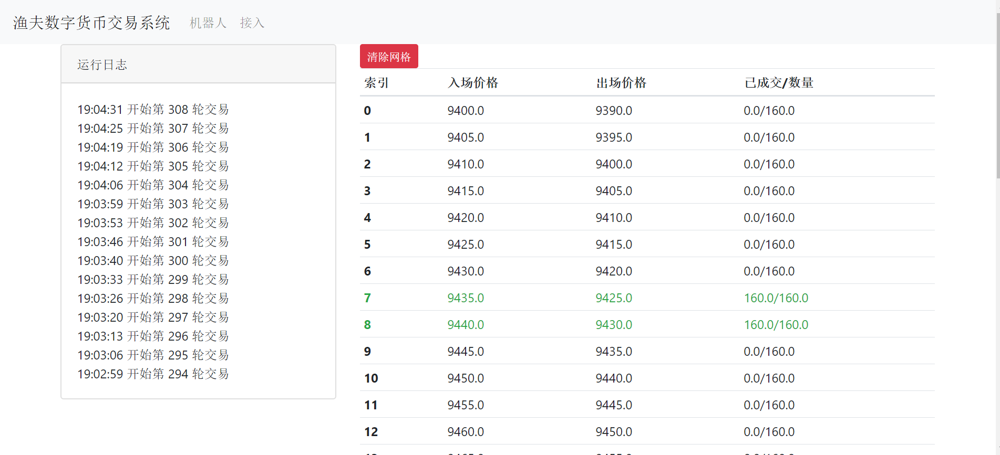

# 渔夫数字货币交易系统

Python 开发的数字货币交易系统。当前版本内置一套网格策略和 Web操盘系统。



## 技术栈

- 编程语言 Python 3
- ccxt 对接数字货币交易所接口
- 操盘系统后端使用 django 开发，Web 界面使用 Bootstrap v4

## 如何使用

确保电脑上有 **Python 3** 运行环境，没有请安装！

**Step1**

克隆或者直接下载代码到本地。

**Step2**

打开命令行，进入到项目根目录，安装必要的依赖（推荐使用 Python 虚拟环境）：

```bash
$ pip install -r requirements.txt
```

**Step3**

运行下面的命令启动操盘系统：

```bash
# 初始化数据库
$ python manage.py migrate
$ python manage.py runscript scripts.init_db

# 创建系统管理员账户
$ python manage.py createsuperuser

# 启动系统
$ python manage.py runserver
```

**Step4**

浏览器打开 http://127.0.0.1:7000/credentials/，点击 **新增** 按钮，绑定交易所的 API Key 和密钥。

**Step5**

点击导航条上的 **机器人** 导航按钮，点击 **新增** 创建一个交易机器人。

**Step6**

点击机器人列表的 id 进入机器人管理页面，在右边的表单输入网格参数创建网格。

**Step7**

进入到项目的 gbot 文件夹下，复制 config.py.example 到相同目录下，重命名为 config.py，按说明修改其中的参数。

**Step8**

命令行输入如下命令启动交易机器人开始交易：

```bash
$ python main.py
```

## 交易逻辑

当前版本暂只支持 BTC 本位合约，机器人会在网格指定的价格卖出 BTC，价格降至止盈价格时买回。

当设置的杠杆<= 1 倍时，等同于高卖低买的现货交易策略。

当设置的杠杆 == 0.5 倍时，可一定程度对冲卖飞风险。

杠杆 >1 才是真正意义上的借贷杠杆交易。

为了提高收益，可提高杠杆倍数，但请仔细分析当前市场环境，风险自担。

## 其他说明

1. 当前版本暂只支持 bybit 交易所的 BTCUSD 交易对（可先用测试网进行模拟盘交易，见下方附录）。
2. 当前版本暂只支持 1 个机器人。
3. 由于权限控制模块还在开发中，当前版本暂只支持本地运行，不建议部署在公网服务器。

## 开发计划

- [ ] 云服务器部署
- [ ] 关键日志推送微信或钉钉
- [ ] Bybit USDT 合约支持
- [ ] 接入 BitMEX 和 3 大交易所
- [ ] 支持 ETH、EOS 合约
- [ ]  支持管理多个交易机器人

## 联系开发者

Email：zmrenwu@gmail.com

WeChat：zmrenwu

## 附录

### Bybit 测试网使用方法

测试网址：https://testnet.bybit.com/

先注册账户，然后在资产页面，点击充值，可领取测试用 BTC、ETH。最容易领取的是 ETH，然后可以使用 Bybit 的兑换功能将 ETH 兑换为 BTC。

创建 API，接入渔夫数字货币交易系统，将 config.py 的 TEST_NET 设置为 True 即可开启模拟盘交易，如图：

