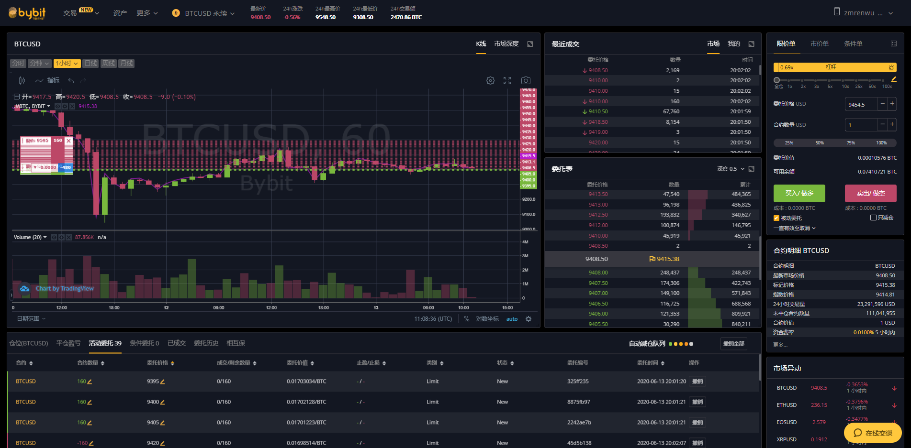

# 渔夫数字货币交易系统

专注于主流交易所、主流数字货币的量化交易，为量化交易者打造一个开源免费的基础平台。

## 系统架构


## 技术栈

Python3、Django、Vue.js。

## 部署

### 基于本机 Python 环境

> 如果部署过程遇到问题，欢迎加入下方的用户体验群获取指导帮助。

这种部署方式适合本机部署，当然也可以在云服务器部署，只需要保证本机或者服务器安装了 Python3.6 以上版本就行。

**Step1**

克隆或者下载代码到本机或者服务器。

```bash
$ git clone https://github.com/zmrenwu/yufuquant.cc.git
# 输出如下
Cloning into 'yufuquant.cc'...
remote: Enumerating objects: 599, done.
remote: Counting objects: 100% (599/599), done.
remote: Compressing objects: 100% (384/384), done.
remote: Total 599 (delta 321), reused 480 (delta 202), pack-reused 0
Receiving objects: 100% (599/599), 2.19 MiB | 1.63 MiB/s, done.
Resolving deltas: 100% (321/321), done.
```

**Step2**

打开命令行，进入到项目根目录，安装必要的依赖（推荐使用 Python 虚拟环境）：

```bash
$ cd yufuquant.cc
$ pip install -r requirements.txt
```

**Step3**

生成并初始化数据：

```bash
$ python manage.py migrate
$ python manage.py runscript yufuquant.scripts.init_db
# 输出
正在初始化数据库...
初始化生成交易所数据...
初始化生成管理员账户...
数据库初始化成功!
```

**Step4**

归集前端资源文件

```bash
$ python manage.py collectstatic --noinput
```

**Step5**

进入 frontend/dist目录，复制 config.example.js 文件，重命名为 config.js，将 config.js 文件中的 127.0.0.1 改为本机或者服务器 ip。

**Step6**

回到项目根目录，复制 yufuquant.example.env 文件，命名为 yufuquant.env，按注释修改各项内容：

```
# 系统密钥，推荐使用下面的工具生成：
# https://www.zmrenwu.com/webtools/django-secret-key-creator 
DJANGO_SECRET_KEY=
# 修改为本机或者服务器的 ip 地址
DJANGO_ALLOWED_HOSTS=127.0.0.1
# sentry 服务 DSN 地址，用于接收系统错误日志，可不填
SENTRY_DSN=
```

**Last Step**

启动服务：

```bash
$ python -m run_uvicorn
# 输出
INFO:     Started server process [20573]
INFO:     Waiting for application startup.
INFO:     ASGI 'lifespan' protocol appears unsupported.
INFO:     Application startup complete.
INFO:     Uvicorn running on http://0.0.0.0:8000 (Press CTRL+C to quit)
```

访问 http://ip:8080，其中 ip 为你本机或者服务器公网 ip，使用默认账户登录（用户名 admin，密码test123456）。

### 基于 Docker 环境

拼命撰写中~~~

> 如果部署过程遇到问题，欢迎加入下方的用户体验群获取指导帮助。

## 运行策略机器人

当前系统提供了一套网格策略机器人，可以在 Bybit 交易所的模拟盘或者实盘运行。后续版本我们会陆续添加主流交易所主流币的实盘策略，并开放 API 和发布 SDK 供第三方策略机器人的开发和接入。

**Step1**

点击导航条的 **接入**，绑定交易所凭据。

**Step2**

点击导航条的 **机器人**，创建一个新的机器人（交易对 BTCUSD，保证金币种 BTC）。

**Step3**

克隆或者直接下载机器人代码到本机或者服务器。仓库地址：[yufu-bot](https://github.com/zmrenwu/yufu-bot)

**Step4**

进入 bot 目录，复制 settings.template.py 为 settings.py，按需求修改相应的配置。

```python
# 创建的机器人 id
ROBOT_ID = 1
# 访问令牌，查看方式为点击右上角的头像->点击账户->查看认证令牌
TOKEN = ""
# 交易时间间隔
TRADE_INTERVAL = 3
REST_BASE_URL = "http://ip:8000/api"
WS_ROBOT_STREAM_URI = "ws://ip:8000/ws/robots/:robot_id/streams/?stream_key=robot-stream-key"
# 钉钉 webhook，填写后交易日志将推送钉钉
DINGTALK_WEBHOOK = ""
DINGTALK_SECRET = ""
```

**Step5**

创建网格

**Step6**

安装依赖，启动机器人。

```bash
$ pipenv install
$ pipenv run python -m bot.grid
```

## 用户体验群

加入用户体验群获取指导和帮助以及和开发者一起决定未来的产品形态和功能。

入群方式请加我微信 zmrenwu，备注渔夫量化。

## 后续开发计划

- [ ] 火币、币安、OKEx 现货、合约实盘策略
- [ ] ETH、EOS 等更多的主流币支持

## 联系开发者

Email：zmrenwu@gmail.com

微信：zmrenwu

## 附录

### Bybit 测试网使用方法

测试网入口：https://testnet.bybit.com/

先注册账户，然后在资产页面，点击充值，可领取测试用 BTC、ETH。最容易领取的是 ETH，然后可以使用 Bybit 的兑换功能将 ETH 兑换为 BTC。

创建 API，接入渔夫数字货币交易系统：

