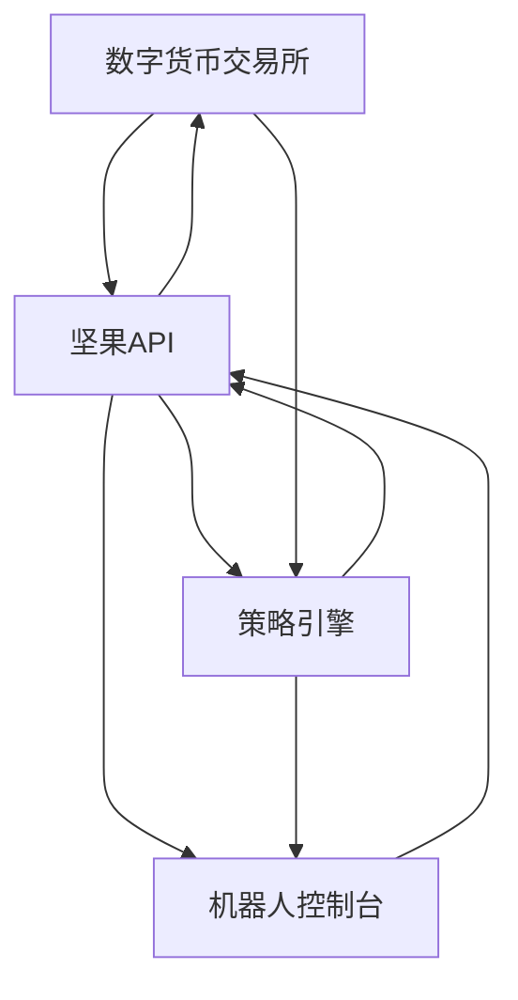

# 坚果量化

坚果量化是一个开源免费的数字货币量化交易系统。使用坚果量化，你可以轻松接入主流数字货币交易所，从海量开源免费的交易策略中选择策略进行量化交易。你还可以使用手机、平板电脑、PC 等设备监控坚果量化交易策略的运行状态并根据市场行情随时调整策略参数。

## 架构

```mermaid
flowchart TD
    Exchange[数字货币交易所]
    Bot[机器人控制台]
    API[坚果API]
    Strategy[策略引擎]
    
    Exchange ---> API
    API ---> Exchange
    Bot ---> API
    API ---> Bot
    API ---> Strategy
    Strategy ---> API
    Exchange ---> Strategy
    Strategy ---> Bot
```

## 部署

文档：[部署](./docs/deploy.md)

## 用户手册

文档：[用户手册](./docs/specification.md)
