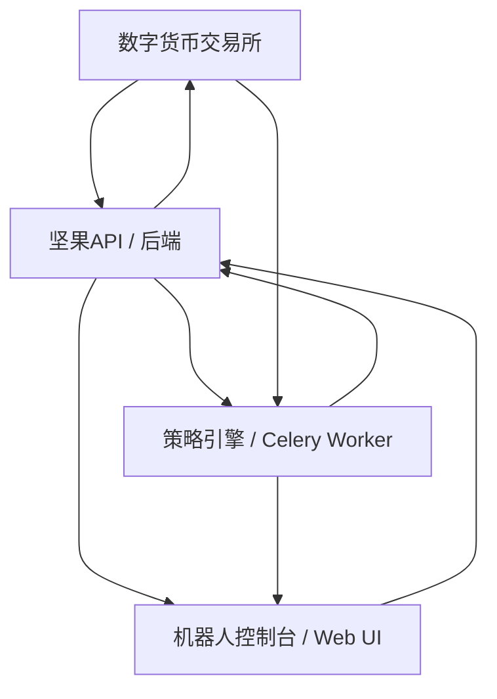

# 坚果量化 (Nuts Quant) 用户使用手册

## 1. 简介

欢迎使用坚果量化！🎉

坚果量化是一个开源免费的数字货币量化交易系统。它允许你：

*   连接到主流的数字货币交易所。
*   选择或开发交易策略来自动执行交易。
*   通过网页界面监控你的交易机器人状态和表现。

本手册将指导你完成系统的部署和基本使用。

## 2. 系统架构概览

坚果量化采用前后端分离的架构：

*   **前端 (用户界面):** 基于 Vue.js 构建，提供图形化的机器人控制台和监控界面。
*   **后端 (API):** 基于 Django (Python) 构建，提供 RESTful API 服务，处理业务逻辑。
*   **策略引擎:** 负责执行具体的交易策略逻辑。
*   **数据库:** 使用 PostgreSQL 存储用户数据、策略、机器人配置、交易记录等。
*   **缓存/消息队列:** 使用 Redis 提高性能并处理异步任务。
*   **部署:** 强烈推荐使用 Docker 和 Docker Compose 进行部署。



## 3. 部署与安装 (Getting Started)

部署坚果量化最推荐的方式是使用 Docker。详细的部署步骤请参考 **[部署文档 (docs/deploy.md)](docs/deploy.md)**。

该文档涵盖了：

*   **准备工作:** 服务器要求、域名（可选）。
*   **安装 Docker 和 Docker Compose:** 在不同操作系统上的安装指南。
*   **下载代码:** 使用 Git 克隆项目。
*   **环境配置:**
    *   **本地开发环境 (`local.yml`):** 用于本地测试和开发。
    *   **生产环境 (`production.yml`):** 用于实际运行。
    *   配置 Nginx (如果使用域名)。
    *   配置前端 API 接口地址 (`config.js`)。
    *   配置环境变量 (`.envs/` 目录下的 `.django` 和 `.postgres` 文件)，包括数据库连接信息、安全密钥等。
*   **构建 Docker 容器:** 使用 `docker-compose build`。
*   **启动系统:** 使用 `docker-compose up -d`。
*   **初始化数据库。**
*   **配置 HTTPS (如果使用域名)。**
*   **常见部署问题解决。**

**请务必仔细阅读并遵循 [部署文档](docs/deploy.md) 中的步骤完成系统的安装。**

## 4. 核心概念

在使用坚果量化之前，了解以下核心概念很重要：

*   **交易所 (Exchange):** 指你希望进行交易的数字货币平台，例如 Binance, OKX 等。
*   **凭证 (Credential):** 指你在交易所申请的 API Key 和 Secret。坚果量化需要这些凭证来代表你执行交易操作。系统会加密存储这些敏感信息。
*   **策略 (Strategy):** 定义了交易规则和逻辑的算法。例如，一个简单的策略可能是"当 MA5 上穿 MA20 时买入，下穿时卖出"。系统可能包含预设策略，也可能支持用户自定义策略（具体取决于实现）。
*   **机器人 (Robot):** 这是实际运行交易策略的执行单元。创建一个机器人通常需要：
    *   选择一个**交易所**。
    *   关联相应的**凭证**。
    *   选择一个**策略**。
    *   配置策略所需的**参数**（例如交易对 `BTC/USDT`，K 线周期 `1h`，每次交易数量等）。

## 5. 使用系统

部署成功并启动系统后，你可以通过浏览器访问前端界面（通常是服务器 IP 地址或配置的域名）。

### 5.1. 登录与账户

*   首次使用可能需要创建账户或使用默认账户（具体取决于初始化设置）。
*   通过用户名和密码登录系统。

### 5.2. 管理交易所凭证

1.  导航到凭证管理或交易所设置区域。
2.  点击"添加凭证"或类似按钮。
3.  选择你想要连接的交易所。
4.  输入你在该交易所申请的 API Key 和 Secret Key。
5.  （可选）输入其他必要信息（如 Passphrase）。
6.  保存凭证。系统将安全地存储这些信息。

### 5.3. 管理策略 (根据系统实现可能不同)

*   **浏览策略:** 查看系统中可用的预设交易策略。
*   **添加/编辑策略:** 如果系统支持，你可能可以添加自己的策略代码或配置现有策略的模板。
*   **配置策略参数:** 理解每个策略需要哪些参数才能运行（例如 K 线周期、指标参数、交易量等）。

### 5.4. 创建和管理机器人

这是系统的核心功能：

1.  导航到机器人管理或仪表盘区域。
2.  点击"创建机器人"或类似按钮。
3.  **命名机器人:** 给你的机器人起一个容易识别的名字。
4.  **选择交易所和凭证:** 从你已添加的凭证中选择一个。
5.  **选择策略:** 选择你想要该机器人运行的交易策略。
6.  **配置策略参数:** 根据所选策略的要求，填写详细参数，例如：
    *   交易对 (如 `ETH/USDT`)
    *   市场类型 (如现货 `spot` 或合约 `future`，取决于策略和交易所支持)
    *   策略特定的数值 (如移动平均线周期、网格间距、止损点等)
    *   初始仓位或资金分配（如果策略需要）
7.  **保存并启动:** 保存机器人配置。你通常可以选择是立即启动机器人还是稍后手动启动。

### 5.5. 监控机器人

创建并启动机器人后，你需要密切监控其运行状态：

*   **机器人列表:** 查看所有机器人的概览，包括名称、状态（运行中/已停止）、交易对、所属策略等。
*   **机器人详情:** 点击特定机器人查看更详细的信息：
    *   **运行日志:** 查看策略执行过程中的输出信息、交易信号、潜在错误等。
    *   **持仓信息:** 查看机器人当前的持仓情况（如果有）。
    *   **订单记录:** 查看机器人发出的历史订单及其状态。
    *   **资产/绩效:** 查看机器人的资产变化、盈亏曲线（PNL）、收益率等绩效指标（基于 `AssetRecord` 和 `AssetRecordSnap`）。
*   **启动/停止机器人:** 你可以随时手动启动或停止一个机器人。

## 6. 系统维护

### 6.1. 更新系统

要更新到最新版本的坚果量化：

1.  进入服务器上的项目代码目录。
2.  拉取最新的代码：
    ```bash
    git pull
    ```
3.  重新构建 Docker 镜像（特别是后端或前端有更新时）：
    ```bash
    # 生产环境
    docker-compose -f production.yml build
    # 本地开发环境
    # docker-compose -f local.yml build
    ```
4.  重新启动服务以应用更新：
    ```bash
    # 生产环境
    docker-compose -f production.yml up -d
    # 本地开发环境
    # docker-compose -f local.yml up -d
    ```
5.  （如果需要）根据版本说明运行数据库迁移命令：
    ```bash
    # 生产环境
    docker-compose -f production.yml exec django python manage.py migrate
    # 本地开发环境
    # docker-compose -f local.yml exec django python manage.py migrate
    ```

### 6.2. 备份

定期备份你的数据库非常重要，以防数据丢失。你可以使用 `docker-compose exec` 进入 `postgres` 容器并使用 `pg_dump` 命令进行备份，或者利用 Docker 卷的备份策略。

## 7. 故障排除

如果在部署或使用中遇到问题：

*   **检查日志:** 使用 `docker-compose logs` 查看各个服务（特别是 `django`, `nginx`, `celeryworker`）的日志输出，查找错误信息。
*   **查阅部署文档:** `docs/deploy.md` 包含了一些常见部署问题的解决方案。
*   **检查配置:** 仔细核对你的环境变量、`config.js` 等配置文件是否正确。

## 8. 获取支持

*   查阅项目 GitHub 仓库 ([https://github.com/We-Hack-Studio/nuts](https://github.com/We-Hack-Studio/nuts)) 的 `README.md` 和 `docs` 目录。
*   在 GitHub Issues 中报告问题或寻求帮助。
*   联系开发者（微信: terryso，来自 `docs/deploy.md`）。

---

**免责声明:** 量化交易涉及风险，请在使用本系统前充分了解相关风险。本手册提供操作指导，但不构成任何投资建议。开发者不对使用本系统造成的任何损失负责。 